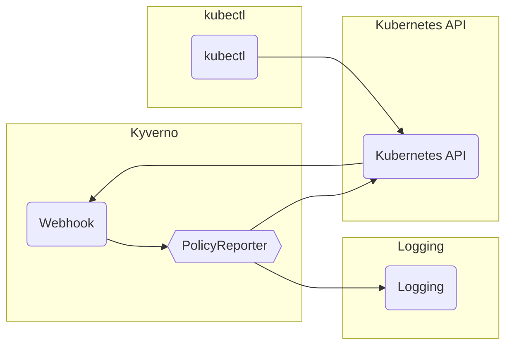

# Kyverno

## Overview

Kyverno is a policy engine designed for Kubernetes, where policies are managed as Kubernetes resources rather than with some domain-specific language. Kyverno policies can be managed by kubectl, git, and kustomize just like app deployments. Kyverno policies can validate, mutate, and generate Kubernetes resources plus ensure OCI image supply chain security, among other things.

## Big Bang Touch Points



### Storage

Data from Kyverno is not stored by the app directly, it is stored as objects in the Kubernetes API.

### Database

Kyverno doesn't have a database.

### Istio Configuration

When deploying to k3d, istio-system should be added from `excludedNamespaces` under the `allowedDockerRegistries` violations. This can be done by modifying `chart/values.yaml` file or passing an override file with the values set as seen below. This is for development purposes only: production should not allow containers in the `istio-system` namespace to be pulled from outside of Registry1. 

```yaml
kyverno:
  values:
    violations:
      allowedDockerRegistries:
        match:
          excludedNamespaces: 
            - istio-system # allows creation for loadbalancer pods for various ports and various vendor loadbalancers
```

## High Availability

High availability is accomplished by increasing the replicas in the values file of this helm chart.

## Single Sign on (SSO)

None. This service doesn't have a web interface.

## Licencing

[Apache 2.0 License](https://github.com/open-policy-agent/gatekeeper/blob/master/LICENSEhttps://github.com/kyverno/kyverno/blob/main/LICENSE)

## Dependencies

None.
