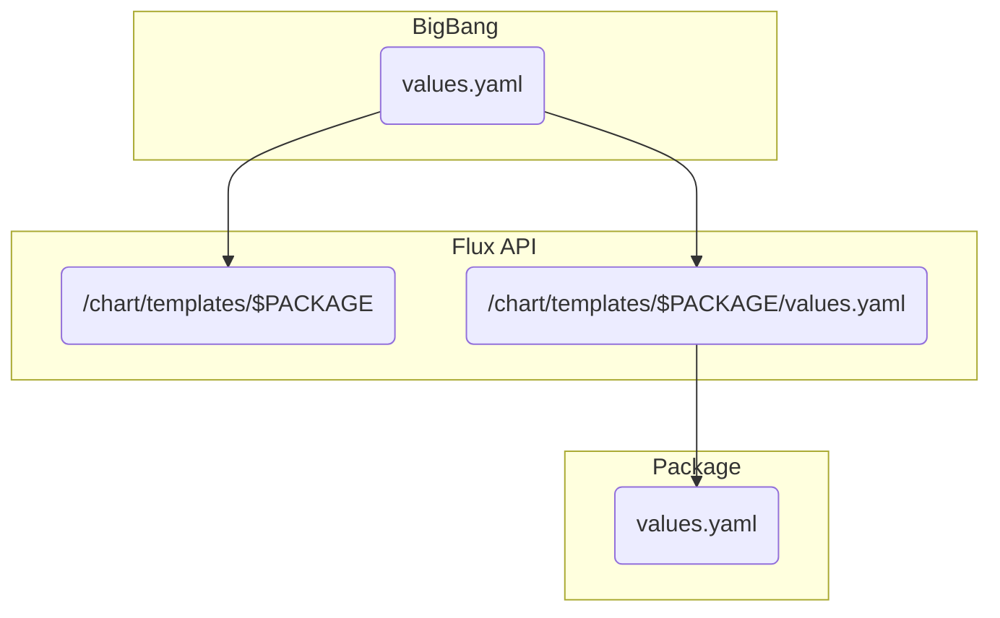

# How Values Pass Through BigBang

## The Basics

BigBang uses [Helm](https://helm.sh/) to handle configuration values for BigBang, so in order to understand how BigBang works it is first essential to understand Helm. Under the hood, Helm is essentially just a template rendering engine: template files are defined where variables are used as placeholders for values, Helm takes those values and interpolates them into the template, then outputs the rendered template file (for Kubernetes, this means YAML). For anyone that has experience with configuration management tools, it is similar in function to Jinja for Ansible and ERB templates for Puppet and Chef.

BigBang takes this basic functionality and uses it to create a somewhat complex set of layers that the values get passed through. Each layer includes a set of separate templates that are unique, yet share some standards, which receive values from the layer above and pass them through to the templates in the layer below. The purpose of this guide is to walk through how this works at a high level to increase the level of understanding amongst the community of BigBang users.

### Additional Information
[Helm Templates and Values](https://helm.sh/docs/topics/charts/#templates-and-values)

## BigBang Specifics

### Values

#### Top-level Values

Every variable defined in BigBang's [values.yaml](/chart/values.yaml) can be considered a top-level value. These are values that the BigBang team has identified as ones which users will be most likely to want to set when installing or upgrading BigBang. This provides a single, standard way to set the most deployment-specific values and many users may not need to do any more than customize these values for their environment.

#### Standard Values

These are the first variables listed in the [values.yaml](/chart/values.yaml) before getting to the variables for each of the packages. These values are passed through to, or referenced by, every BigBang package, meaning setting these variables sets them for every package you are deploying via BigBang. An example of a standard value is `domain`:

```
1 | # -- Domain used for BigBang created exposed services, can be overridden by individual packages.
2 | domain: bigbang.dev
3 | ...

```

The variables related to Gateways in the Istio package can also be considered standard values, as Istio Gateways control all traffic coming into the cluster and the rules governing the routing of this traffic is defined in each package. Every package which could be exposed to traffic coming in from outside the cluster has an `ingress` variable defined which must reference the name of a Gateway defined and configured in the Istio package.

#### Custom Values

Every package has more variables than are listed in BigBang's `values.yaml`, but just because they aren't listed doesn't mean you can't set them. Every package has a `values: {}` section where you can set additional variables which are defined in the chart but not curated in BigBang's `values.yaml`. These values must be defined in JSON but they get passed through to the package just like any other. See the respective package repo itself to see all the variables you can set for it this way.

#### Post-renderers

These are an advanced Helm capability to make final modifications to the chart after it has been rendered. For more information see [here](/docs/postrenderers.md).

### Hierarchy

The variables in BigBang's `values.yaml` file are first passed to Flux and then through to the package itself. Flux has an API for managing application deployments in a GitOps manner; technically speaking, when you deploy BigBang, you are deploying a bunch of Flux objects and Flux does the heavy lifting to deploy the actual applications. For more information on Flux, see its official [documentaion](https://fluxcd.io/docs/components/).

A conceptual graph of how the values flow through is provided below:



