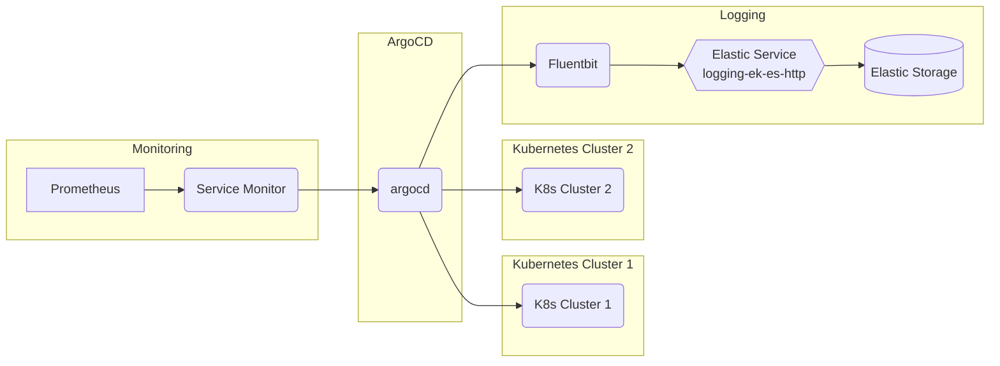

# Argocd

## Overview

Argo CD is a declarative, [GitOps](https://www.gitops.tech/) continuous delivery tool for Kubernetes.

ArgoCD is a kubernetes native tool that enables the delivery of GitOps practices.  It uses a git repository as a source of truth in defining the desired state.  It is implemented as a kubernetes controller continously montoring running applications and reconciling it against the desired state in the source git repository.


Argo CD uses an Application Controller component to continuously watch applications that are executing.  Argo CD then differentiates the applications live state against the target state that resides in the Git repository. It supports a range of configuration management tools such as [Helm](https://helm.sh/), [kustomize](https://kustomize.io/), [ksonnet](https://ksonnet.io/get-started/), and [jsonnet](https://jsonnet.org/).

### Argocd



For more information on the Argocd architecture, see [Argocd Architectural Overview](https://argo-cd.readthedocs.io/en/stable/operator-manual/architecture/).

## Big Bang Touch Points

### Licensing

The Big Bang Argocd deployment uses a permissive license (i.e., a free-software license which instead of copyleft protections, carries only minimal restrictions on how the software can be used, modified, and redistributed.) whose main conditions require preservation of copyright and license notices. Contributors provide an express grant of patent rights. Licensed works, modifications, and larger works may be distributed under different terms and without source code.

### Single Sign On

ArgoCD an be configured to support user login to the UI using identities from external identity providers that support SAML 2.0.

See below for an example of the values to provide to argocd for SSO setup:

```yaml
addons:
  argocd:
    sso:
      enabled: true
      client_id:
      client_secret: ""
      provider_name: ""
      groups: |
        g, Impact Level 2 Authorized, role:admin
```

### Storage

Argo CD is largely stateless, all data is persisted as Kubernetes objects, which in turn is stored in Kubernetes' etcd. Redis is only used as a throw-away cache and can be lost. When lost, it will be rebuilt without loss of service.

### High Availability

High Availability installation is recommended for production use. This bundle includes the same components but tuned for high availability and resiliency.

- [ha/install.yaml](https://github.com/argoproj/argo-cd/blob/master/manifests/ha/install.yaml) - the same as install.yaml but with multiple replicas for supported components.

- [ha/namespace-install.yaml](https://github.com/argoproj/argo-cd/blob/master/manifests/ha/namespace-install.yaml) - the same as namespace-install.yaml but with multiple replicas for supported components.

The following is an example of how to modify the Big Bang values to accommodate a HA deployment.

```yaml
addons:
  argocd:
    values:
      controller:
        replicas: 2
      server:
        replicas: 2  
      repoServer:
        replicas: 2              
```

_Note:_ A production HA deployment of argocd within Big Bang has not yet been produced and results may vary.

For additional information about an ArgoCD high availability installation visit [ArgoCD High Availability](https://argo-cd.readthedocs.io/en/stable/operator-manual/installation/#high-availability)

### UI

ArgoCD includes a UI, which is accessible at the specified URL. The UI can be used to view, manage, and create applications.

### Logging

Argo CD logs payloads of most API requests except request that are considered sensitive, such as /cluster.ClusterService/Create, /session.SessionService/Create etc. The full list of method can be found in server/server.go For more information, see [ArgoCD Logs](https://argo-cd.readthedocs.io/en/stable/operator-manual/security/#logging).

_Note:_ within Big Bang, logs are captured by fluentbit and shipped to elastic by default.

```yaml
addons:
  argocd:
    values:
      controller:
        # -- Set the logging level. (One of: `debug`, `info`, `warn`, `error`)
        logLevel: debug
        # -- Application controller log format. Either `text` or `json`
        logFormat: text
      server:
        # -- Set the logging level. (One of: `debug`, `info`, `warn`, `error`)
        logLevel: debug
        # -- Application controller log format. Either `text` or `json`
        logFormat: text    
      repoServer:
        # -- Set the logging level. (One of: `debug`, `info`, `warn`, `error`)
        logLevel: debug
        # -- Application controller log format. Either `text` or `json`
        logFormat: text           
```

### Monitoring

ArgoCD exposes prometheus metrics in the API of each service if the config.yaml used by that service has the metrics.enabled keys set to enabled and metrics.servicemonitor keys set to true. Each service exports its own metrics and is typically scraped by a Prometheus installation to gather the metrics.

The Big Bang ArgoCD Helm chart has been modified to use your `monitoring:` values in Big Bang to automatically toggle metrics on/off.

### Health Checks

Argo CD provides built-in health assessment for several standard Kubernetes types, which is then surfaced to the overall Application health status as a whole.

For more information, see [ArgoCD Resource Health](https://argo-cd.readthedocs.io/en/stable/operator-manual/health/).
