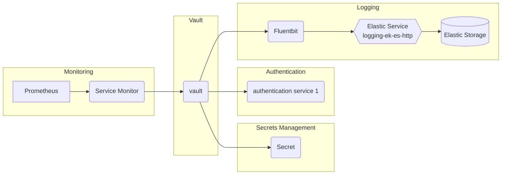

# Vault

## Overview

[Vault](https://www.vaultproject.io/) provides secret management and protects sensitive data. Hashicorp Vault secure, stores and tightly controls access to tokens, passwords, certificates, encryption keys for protecting secrets and other sensitive data using a UI, CLI, or HTTP API.
Docker container static analysis and policy-based compliance system that automates the inspection, analysis, and evaluation of images against user-defined checks to allow high confidence in container deployments by ensuring workload content meets the required criteria.

### Vault



For more information on the Hashicorp Vault architecture, see [Hashicorp Vault](https://www.vaultproject.io/docs/internals/architecture).

## Big Bang Touch Points

### Licensing

The Big Bang Vault deployment uses a Mozilla Public License. The license is an open source copyleft license. The MPL's "file-level" copyleft is designed to encourage contributors to share modifications they make to your code, while still allowing them to combine your code with code under other licenses (open or proprietary) with minimal restrictions.

### Storage

Vault supports several storage options for the durable storage of Vault's information. As of Vault 1.4, an Integrated Storage option is offered. This storage backend does not rely on any third party systems; it implements high availability, supports Enterprise Replication features, and provides backup/restore workflows.

### High Availability

Vault supports a multi-server mode for high availability. This mode protects against outages by running multiple Vault servers. High availability mode is automatically enabled when using a data store that supports it.
Vault supports one or more servers to scale out the deployment. To scale the deployment in Big Bang, the following is recommended:

```yaml
addons:
  vault:
    values:
      server:
        ha:
          enabled: true
          replicas: 3
```

### UI

Vault features a web interface for interacting with Vault. Through the UI you are able to create, read, update, and delete secrets, authenticate, unseal, and more.

_Note:_ The UI requires Vault 0.10 or higher

### Logging

Vault produces detailed logs that contain information about user interactions, internal processes, warnings and errors. The verbosity of the logs is controlled using the /sys/loggers endpoint. The log levels are DEBUG, INFO, WARN, ERROR, and TRACE. It is always recommended to increase the log level to DEBUG in order to ensure the availability of the maximum amount of information.

For more information, see [Vault Loggers](https://www.vaultproject.io/api-docs/system/loggers).

_Note:_ within Big Bang, logs are captured by fluentbit and shipped to elastic by default.

### Monitoring

The `/sys/metrics` endpoint is used to get telemetry metrics for Vault. This endpoint returns the telemetry metrics for Vault. It can be used by metrics collections systems like Prometheus that use a pull model for metrics collection

For more information on Vault monitoring see the following, [Vault Monitoring](https://www.vaultproject.io/api-docs/system/metrics)

The Big Bang Vault Helm chart has been modified to use your `monitoring:` values in Big Bang to automatically toggle metrics on/off.

### Health Checks

The `/sys/health` endpoint is used to check the health status of Vault. This endpoint returns the health status of Vault. This matches the semantics of a Consul HTTP health check and provides a simple way to monitor the health of a Vault instance.

For more information, see [Vault System Health](https://www.vaultproject.io/api-docs/system/health).
